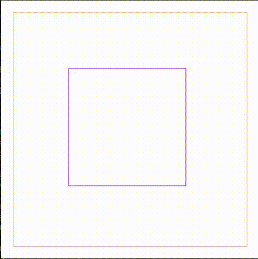

# About

This repo contains some algorithms and other cool things I played around with.
It is kind of a catch-all for algorithms that sound cool, are cool, but don't deserve their own project. Visualizations and GUIs are usually written with JavaFx.

## Pathfinding

I wrote a small GUI to visualize pathfinding, modelled after the excellent online tool
found [here](https://qiao.github.io/PathFinding.js/visual/).

So far it supports the following algorithms:

* Breadth first search
* Depth first search
* Dijkstra
* A\*
* Jump point search

and the following distance heuristics:
* Manhatten
* Euclidian
* Chebyshev

### See a small demo in a way too big gif

## Parsing of mathematical expressions

A small parser using Dijkstra's "Shunting Yard" algorithm converts a given mathematical
expression to an abstract syntax tree (AST). The parser is able to handle variables,
literals, arithmetic operators and methods, the latter even with varying arity.

### See a small screenshot of the generated Tree

The result can be found at the top, in the title of the window. The first part is the
expression, the second the resulting value, which is hopefully correct.

## Quadtree

It also contains a small and simple implementation of a QuadTree. It supports adding
nodes, clearing the tree and spatial queries for a rectangular region. Stored objects are
2D, i.e. the tree only stores points, not regions.

### See a small gif of it

## Other things in the repo

* A BinaryHeap, used for a BinarySearch
* A BubbleSort, because comparing the runtime of the two is fun
